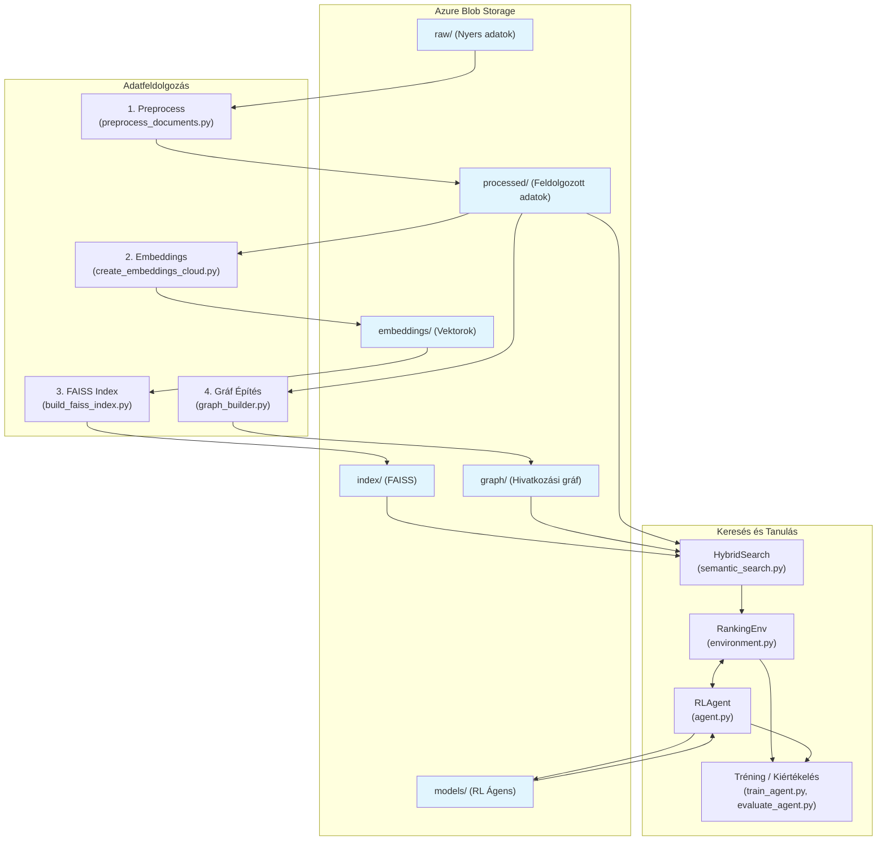

# CourtRankRL: Magyar Bírósági Határozatok Szemantikus Keresőrendszere Megerősítéses Tanulással

## Projekt Áttekintés

Ez a projekt egy komplex, end-to-end felhőalapú megoldást mutat be magyarországi bírósági határozatok hatékony szabadszöveges keresésére. A rendszer egy többlépcsős architektúrát implementál, amely Azure Blob Storage-ra épül, és a teljes adatfeldolgozási, modellezési és keresési folyamatot a felhőben kezeli. A megoldás egy szemantikus keresőt kombinál egy megerősítéses tanulással (RL) finomhangolt intelligens ágenssel, amely a találati listát optimalizálja a releváns dokumentumok jobb rangsorolása érdekében.

## Kutatási Motiváció

A modern jogi információkeresés egyik legnagyobb kihívása a szabadszöveges lekérdezések hatékony feldolgozása nagy volumenű dokumentumkorpuszokon. Ez a projekt egy innovatív, felhő-natív megközelítést alkalmaz, amely ötvözi a modern nyelvmodell-alapú szemantikus keresést a megerősítéses tanulás adaptív optimalizálási képességeivel, egy skálázható és robusztus Azure-infrastruktúrán.

## Rendszer Architektúra

A rendszer az adatkezelést teljes mértékben az Azure Blob Storage-ban centralizálja. Minden adat, a nyers dokumentumoktól kezdve a feldolgozott adatokon, embeddingeken, FAISS indexen, gráfon át egészen a betanított modellekig és kiértékelésekig, itt tárolódik. Az egyes komponensek a központi `AzureBlobStorage` segédprogramon keresztül kommunikálnak a tárolóval.

A következő diagram ábrázolja a rendszer főbb logikai egységeit és az adatfolyamot:



### Főbb Rendszerkomponensek

- **Adattárolás**: Az összes adatartefaktum (Parquet, JSON, bináris modellek) központilag, egyetlen Azure Blob Storage konténerben van tárolva, logikai "könyvtár" struktúrában.
- **Adatfeldolgozó Szkriptek**: A `src/data_loader` és `src/embedding` modulokban található szkriptek felelősek a nyers adatok letöltéséért, feldolgozásáért és a végeredmények visszatöltéséért az Azure-ba. A folyamat teljesen automatizált és memóriában történik, ahol lehetséges.
- **Hibrid Keresési Motor**: A `HybridSearch` osztály (`src/search/semantic_search.py`) betölti a FAISS indexet, a gráfot és a metaadatokat az Azure-ból, és egy egységes felületet biztosít a komplex keresési lekérdezésekhez.
- **RL Optimalizálás**: A `RankingEnv` környezet és az `RLAgent` ágens önállóan kezelik a szükséges modellek és adatok betöltését az Azure-ból, valamint a tanítás során keletkezett modellek mentését.

## Technológiai Stack

- **Cloud Platform**: Microsoft Azure (Blob Storage)
- **Embedding Model**: `Qwen/Qwen3-Embedding-0.6B` (HuggingFace Transformers)
- **Vector Search**: `faiss-cpu` (Facebook AI Similarity Search)
- **RL Framework**: PyTorch + Gymnasium
- **Data Processing**: Pandas, NumPy, NetworkX, PyArrow
- **Infrastructure**: Python 3.9+, Conda
- **Cloud SDK**: `azure-storage-blob`

## Telepítés és Beállítás

A projekt futtatásához szükséges környezet beállítása `conda` segítségével javasolt az `environment.yml` fájl alapján.

1.  **Hozza létre a conda környezetet:**
    ```bash
    conda env create -f environment.yml
    ```

2.  **Aktiválja a környezetet:**
    ```bash
    conda activate courtrankrl
    ```

3.  **Állítsa be az Azure kapcsolati stringet:**
    Hozzon létre egy `.env` fájlt a projekt gyökérkönyvtárában a következő tartalommal, és cserélje ki a placeholder értéket a saját Azure Storage fiókjának kapcsolati stringjére:

    ```ini
    # .env
    AZURE_CONNECTION_STRING="<AZ_AZURE_BLOB_STORAGE_KAPCSOLATI_STRING>"
    ```
    A rendszer automatikusan betölti ezt a változót a `python-dotenv` csomag segítségével.

## A Projekt Futtatása

A teljes adatfeldolgozási és modellépítési lánc a `src/` könyvtárban található szkriptek futtatásával indítható. A szkriptek a `configs/config.py`-ban definiált Azure blob útvonalakat használják a bemeneti és kimeneti adatok kezelésére.

**Példa a folyamatra:**
1.  Töltse fel a nyers adatokat az Azure Blob Storage `raw/` "könyvtárába".
2.  Futtassa a `src/data_loader/preprocess_documents.py` szkriptet.
3.  Futtassa a `src/embedding/create_embeddings_cloud.py` szkriptet (GPU-s környezetben).
4.  Futtassa a `src/data_loader/build_faiss_index.py` szkriptet.
5.  Futtassa a `src/data_loader/graph_builder.py` szkriptet.
6.  Indítsa el a modell tanítását a `src/reinforcement_learning/train_agent.py` szkripttel.

## Kutatási Hozzájárulások

### 1. Felhő-Natív Hibrid Keresési Architektúra
A projekt egy olyan skálázható, felhőalapú architektúrát valósít meg, amely kombinálja a szemantikus embeddingeket, a gráf alapú kapcsolati hálózatokat és a megerősítéses tanulást, teljes mértékben az Azure ökoszisztémára támaszkodva.

### 2. Magyar Jogi Domain Adaptáció
Specializált, felhőben futtatható pipeline magyar bírósági határozatok feldolgozására, amely figyelembe veszi a jogi terminológia és a magyar nyelv sajátosságait.

### 3. Szabály-alapú Reward Modelling
Innovatív objektív értékelési rendszer, amely szakértői annotáció helyett szabály-alapú kritériumokat használ (pontosság, relevancia, NDCG).

---

**Készítette**: Zelenyiánszki Máté
**Intézmény**: Pannon Egyetem 
**Kutatási terület**: Természetes Nyelvfeldolgozás, Információvisszakeresés, Megerősítéses Tanulás  
**Implementáció**: Python, PyTorch, HuggingFace Transformers, Azure Blob Storage
**Licenc**: Kutatási célú felhasználás