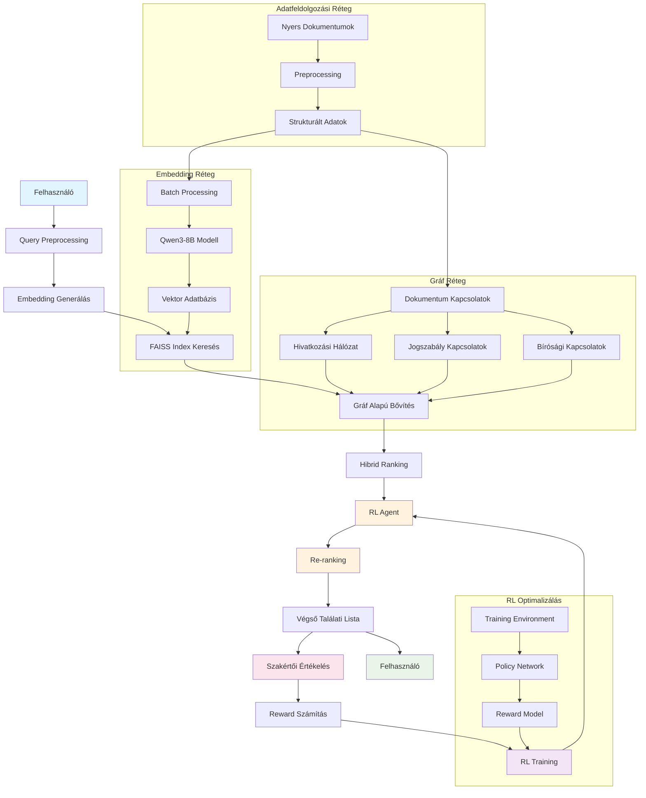

# Magyar Bírósági Határozatok Szemantikus Keresőrendszere Megerősítéses Tanulással

## Szakdolgozat Áttekintés

Ez a projekt egy komplex, end-to-end megoldást mutat be magyarországi bírósági határozatok hatékony szabadszöveges keresésére. A rendszer egy többlépcsős architektúrát implementál, amely kezdetben szemantikus embeddingek alapján végez hasonlóság-alapú keresést, majd megerősítéses tanulással (RL) finomhangolt intelligens ágensek segítségével optimalizálja a végső találati listát a releváns dokumentumok jobb rangsorolása érdekében.

## Kutatási Motiváció

A modern jogi információkeresés egyik legnagyobb kihívása a szabadszöveges lekérdezések hatékony feldolgozása nagy volumenű dokumentumkorpuszokon. A hagyományos kulcsszó-alapú keresési rendszerek gyakran nem képesek megfelelően kezelni a jogi terminológia komplexitását és a kontextuális jelentéseket. Ez a projekt egy innovatív megközelítést alkalmaz, amely ötvözi a modern nyelvmodell-alapú szemantikus keresést a megerősítéses tanulás adaptív optimalizálási képességeivel.

## Rendszer Architektúra

A következő diagram ábrázolja a teljes end-to-end rendszer működését a felhasználói lekérdezéstől a megerősítéses tanulással optimalizált végső eredményig:

### Főbb Rendszerkomponensek

- **Adatfeldolgozási Réteg**: 213,398 bírósági határozat preprocessing és strukturálása
- **Embedding Réteg**: Qwen3-8B (8192D) modell batch feldolgozással A100 80GB GPU-n
- **Gráf Réteg**: NetworkX irányított gráf 1,585,738 csomóponttal és 4,412,596 éllel
- **Hibrid Keresési Motor**: FAISS ANN + gráf traversal algoritmusok kombinációja
- **RL Optimalizálás**: RankingEnv + PolicyNetwork + NDCG-alapú reward modell

### Megerősítéses Tanulás alapú Re-ranking

A projekt legfőbb innovációja egy intelligens re-ranking rendszer, amely DeepSeek által kifejlesztett **Group Relative Policy Optimization (GRPO)** algoritmussal optimalizálja a keresési eredményeket.

## Technológiai Stack

### Core Components
- **Embedding Model**: Qwen/Qwen3-8B (HuggingFace Transformers)
- **Vector Search**: FAISS (Facebook AI Similarity Search)
- **RL Framework**: PyTorch + Gymnasium
- **Data Processing**: Pandas, NumPy
- **Infrastructure**: Python 3.9+, CUDA 11.8+

### Cloud Infrastructure
- **GPU Platform**: RunPod, Vast.ai
- **Recommended Hardware**: A100 80GB GPU
- **Memory**: 64GB+ RAM ajánlott

## Kutatási Hozzájárulások

### 1. GRPO-alapú Hibrid Keresési Architektúra
Első alkalommal alkalmazza a DeepSeek GRPO algoritmusát jogi dokumentumkeresésben, kombinálja nagy léptékű szemantikus embeddingeket, gráf alapú kapcsolati hálózatot és hatékony megerősítéses tanulást.

### 2. Magyar Jogi Domain Adaptáció
Specializált pipeline magyar bírósági határozatok feldolgozására, amely figyelembe veszi a jogi terminológia sajátosságait és a magyar nyelv specifikus jellemzőit.

### 3. Szabály-alapú Reward Modelling
Innovatív objektív értékelési rendszer, amely szakértői annotáció helyett szabály-alapú kritériumokat használ (pontosság, relev

## Jövőbeli Fejlesztési Irányok

### Rövidtávú Célok
- **Multi-modal embedding**: Dokumentum metaadatok integrálása
- **Hierarchikus keresés**: Jogterület-specifikus specializáció
- **Real-time learning**: Online RL algoritmusok implementálása

### Hosszútávú Vízió
- **Interdiszciplináris keresés**: Kapcsolódó jogterületek összekötése
- **Prediktív elemzés**: Hasonló ügyek kimenetelének előrejelzése

## Szakdolgozat Kontribúciók

Ez a projekt demonstrálja, hogy a modern gépi tanulási technikák kombinációja jelentős javulást eredményezhet a specializált domain-specifikus keresési feladatokban. A megerősítéses tanulás alkalmazása a keresési eredmények re-ranking problémájára újszerű megközelítést jelent a magyar NLP kutatásokban.

A rendszer nem csupán egy technikai implementáció, hanem egy teljes kutatási framework, amely alkalmas további jogi informatikai alkalmazások fejlesztésére és a szemantikus keresés területén végzett alapkutatások támogatására.

---

**Készítette**: Zelenyiánszki Máté
**Intézmény**: Pannon Egyetem 
**Kutatási terület**: Természetes Nyelvfeldolgozás, Információvisszakeresés, Megerősítéses Tanulás  
**Implementáció**: Python, PyTorch, HuggingFace Transformers  
**Licenc**: Kutatási célú felhasználás