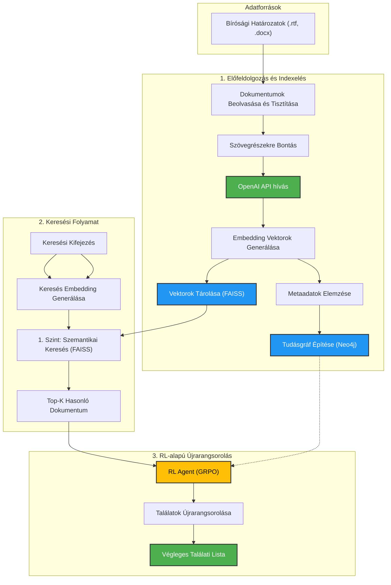

# Intelligens Kereső és Rangsoroló Rendszer Bírósági Határozatokhoz

A projekt egy komplex, szemantikus keresőrendszert valósít meg magyar nyelvű bírósági határozatok visszakeresésére és intelligens rangsorolására. A rendszer a legmodernebb természetesnyelv-feldolgozási (NLP) és gépi tanulási technikákat alkalmazza, hogy a hagyományos, kulcsszó-alapú keresőknél pontosabb és relevánsabb találatokat biztosítson.

A megoldás lelke egy kétlépcsős keresési folyamat:
1.  **Szemantikus Keresés:** A dokumentumok és a keresési kifejezés jelentésrétegét is megérti, és a tartalmi hasonlóság alapján adja vissza a legrelevánsabb dokumentumokat.
2.  **Megerősítéses Tanuláson (RL) Alapuló Újrarangsorolás:** Egy tanított RL ágens tovább finomítja a találati listát, figyelembe véve a dokumentumok közötti komplex kapcsolatokat és a jogi relevancia finomabb árnyalatait.

## Architektúra

A rendszer moduláris felépítésű, amely több, jól definiált komponensből áll. Az alábbi diagram a teljes adatfeldolgozási és keresési folyamatot szemlélteti.



## Főbb Jellemzők

- **Szemantikus Szövegfeldolgozás:** Transzformer-alapú `text-embedding-3-small` modell (OpenAI) a szövegek mély kontextuális megértéséhez.
- **Nagy Sebességű Keresés:** A `FAISS` (Facebook AI Similarity Search) könyvtár villámgyors hasonlósági keresést tesz lehetővé több millió dokumentum között is.
- **Tudásgráf-alapú Modellezés:** A `NetworkX` és `Neo4j` segítségével a rendszer feltérképezi a dokumentumok, hivatkozások és jogi entitások közötti kapcsolatokat, ami mélyebb elemzési lehetőségeket nyit meg.
- **Intelligens Rangsorolás:** Megerősítéses tanulási (Reinforcement Learning) ágens (GRPO algoritmus) optimalizálja a találatok sorrendjét a maximális relevancia érdekében.
- **Moduláris és Skálázható:** A komponensek lazán csatoltak, ami lehetővé teszi a könnyű továbbfejlesztést és skálázást.
- **Automatizált Adatfeldolgozás:** A teljes folyamat a nyers dokumentumoktól a kész indexig szkriptekkel automatizált.

## Technológiai Készlet

- **Programozási nyelv:** Python 3.10+
- **NLP / ML:** PyTorch, Transformers, Scikit-learn
- **Embeddingek:** OpenAI API (`text-embedding-3-small`)
- **Vektor Adatbázis:** FAISS
- **Gráf Adatbázis:** Neo4j (a `graph_builder.py` által generált adatokkal feltölthető)
- **Adatkezelés:** Pandas, NumPy, PyArrow
- **Segédprogramok:** TQDM, python-dotenv, backoff

## Telepítés és Beüzemelés

1.  **Klónozza a repozitóriumot:**
    ```bash
    git clone https://github.com/docriny/Szakdolgozat.git
    cd Szakdolgozat
    ```

2.  **Hozzon létre és aktiváljon egy virtuális környezetet:**
    ```bash
    python -m venv venv
    source venv/bin/activate
    # Windows-on: venv\Scripts\activate
    ```

3.  **Telepítse a szükséges csomagokat:**
    A `requirements.txt` fájl tartalmazza az összes szükséges függőséget rögzített verziókkal a reprodukálhatóság érdekében.
    ```bash
    pip install -r requirements.txt
    ```

4.  **Konfigurálja a környezeti változókat:**
    Másolja le az `.env.example` fájlt `.env` néven.
    ```bash
    cp .env.example .env
    ```
    Ezután szerkessze az újonnan létrehozott `.env` fájlt, és adja meg a saját titkos kulcsait:
    ```
    # OpenAI API Key
    OPENAI_API_KEY="ide_masold_az_openai_kulcsodat"

    # Neo4j Database Credentials
    NEO4J_USER="neo4j"
    NEO4J_PASSWORD="ide_masold_a_neo4j_jelszavadat"
    ```
    
5. **Adatok elhelyezése:**
   Helyezze a feldolgozandó `.rtf` és `.docx` bírósági határozatokat a `data/` mappába, a `config.py`-ban megadott struktúrát követve.

## Használat

A projekt szkriptjei a `src/data_loader` és `src/reinforcement_learning` mappákban találhatók. A futtatásukat a projekt gyökérkönyvtárából javasolt végrehajtani az alábbi sorrendben:

1.  **Dokumentumok előfeldolgozása:**
    ```bash
    python src/data_loader/preprocess_documents.py
    ```
2.  **Adatok tisztítása (opcionális, de javasolt):**
    ```bash
    python src/data_loader/eda_clean_for_embedding.py
    ```
3.  **Embeddingek generálása:**
    ```bash
    python src/data_loader/generate_embeddings.py
    ```
4.  **FAISS index építése:**
    ```bash
    python src/data_loader/build_faiss_index.py
    ```
5.  **Gráf építése:**
    ```bash
    python src/data_loader/graph_builder.py
    ```
6.  **RL ágens tanítása:**
    ```bash
    python src/reinforcement_learning/train_agent.py
    ```

## Projekt Felépítése

```
Szakdolgozat/
├── configs/              # Konfigurációs fájlok
├── data/                 # Nyers adatok helye (a .gitignore-ban kizárva)
├── notebooks/            # Jupyter notebookok exploratív adatelemzéshez
├── processed_data/       # Feldolgozott adatok (CSV, Parquet, GML) (kizárva)
├── src/                  # A projekt forráskódja
│   ├── data_loader/      # Adatbetöltő és feldolgozó szkriptek
│   ├── reinforcement_learning/ # RL-alapú rangsoroló modul
│   └── search/           # Keresési logika
├── .env.example          # Környezeti változók sablonja
├── .gitignore            # Verziókezelésből kizárt fájlok listája
├── requirements.txt      # Projekt függőségek
└── README.md             # Ez a dokumentum
```

## Jövőbeli Fejlesztési Irányok

- **Webes Felület:** Egy interaktív, felhasználóbarát keresőfelület készítése (pl. Streamlit vagy Flask segítségével).
- **Gráfalapú Keresés:** A tudásgráf aktívabb bevonása a keresési folyamatba a komplex, több lépcsős lekérdezések támogatásához.
- **Alternatív Modellek:** Más embedding modellek (akár nyílt forráskódú, saját gépen futtatható) és RL algoritmusok kipróbálása és összehasonlítása.
- **Online Tanulás:** Az RL ágens folyamatos finomhangolása a felhasználói visszajelzések alapján.
- **Teljesítményoptimalizálás:** A teljes pipeline sebességének és erőforrás-hatékonyságának további javítása.
