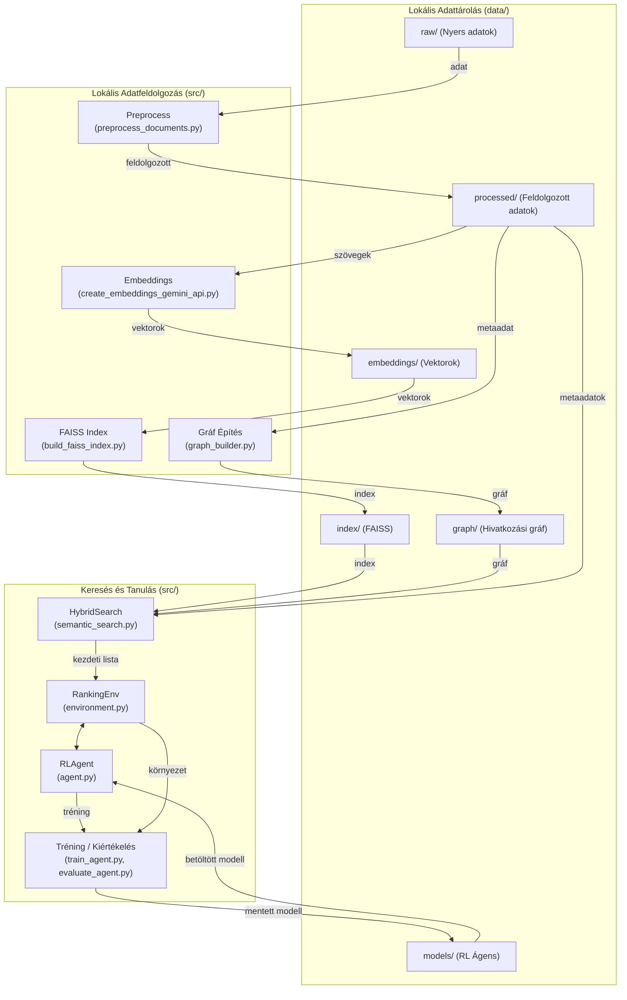

# CourtRankRL: Magyar Bírósági Határozatok Szemantikus Keresőrendszere Megerősítéses Tanulással

## Projekt Áttekintés

Ez a projekt egy komplex, end-to-end megoldást mutat be magyarországi bírósági határozatok hatékony szabadszöveges keresésére. A rendszer egy többlépcsős architektúrát implementál, amely a lokális fájlrendszerre épül, és a teljes adatfeldolgozási, modellezési és keresési folyamatot helyben kezeli. A megoldás egy szemantikus keresőt kombinál egy megerősítéses tanulással (RL) finomhangolt intelligens ágenssel, amely a találati listát optimalizálja a releváns dokumentumok jobb rangsorolása érdekében.

## Kutatási Motiváció

A modern jogi információkeresés egyik legnagyobb kihívása a szabadszöveges lekérdezések hatékony feldolgozása nagy volumenű dokumentumkorpuszokon. Ez a projekt egy innovatív megközelítést alkalmaz, amely ötvözi a modern nyelvmodell-alapú szemantikus keresést a megerősítéses tanulás adaptív optimalizálási képességeivel.

## Rendszer Architektúra

A rendszer az adatkezelést a projekt gyökérkönyvtárában található `data/` könyvtárban centralizálja. Minden adat, a nyers dokumentumoktól kezdve a feldolgozott adatokon, embeddingeken, FAISS indexen, gráfon át egészen a betanított modellekig és kiértékelésekig, itt tárolódik.

A következő diagram ábrázolja a rendszer főbb logikai egységeit és az adatfolyamot:



### Főbb Rendszerkomponensek

- **Adattárolás**: Az összes adatartefaktum (Parquet, JSON, bináris modellek) központilag, a projekt `data/` könyvtárában van tárolva, logikai alkönyvtár struktúrában.
- **Adatfeldolgozó Szkriptek**: A `src/data_loader` és `src/embedding` modulokban található szkriptek felelősek a nyers adatok beolvasásáért, feldolgozásáért és az eredmények elmentéséért.
- **Hibrid Keresési Motor**: A `HybridSearch` osztály (`src/search/semantic_search.py`) betölti a FAISS indexet, a gráfot és a metaadatokat a `data/` könyvtárból.
- **RL Optimalizálás**: A `RankingEnv` környezet és az `RLAgent` ágens önállóan kezelik a szükséges modellek és adatok betöltését a lokális `data/` könyvtárból, valamint a tanítás során keletkezett modellek mentését.

## Technológiai Stack

- **Cloud API**: Google Gemini API (Embedding generáláshoz)
- **Embedding Model**: `models/text-embedding-004`
- **Vector Search**: `faiss-cpu` (Facebook AI Similarity Search)
- **RL Framework**: PyTorch + Gymnasium
- **Data Processing**: Pandas, NumPy, NetworkX, PyArrow
- **Infrastructure**: Python 3.9+, Conda

## Telepítés és Beállítás

A projekt futtatásához szükséges környezet beállítása `conda` segítségével javasolt az `environment.yml` fájl alapján.

1.  **Hozza létre a conda környezetet:**
    ```bash
    conda env create -f environment.yml
    ```

2.  **Aktiválja a környezetet:**
    ```bash
    conda activate courtrankrl
    ```

3.  **Állítsa be a Gemini API kulcsot:**
    Hozzon létre egy `.env` fájlt a projekt gyökérkönyvtárában a következő tartalommal, és cserélje ki a placeholder értéket a saját Google Gemini API kulcsára:

    ```ini
    # .env
    GEMINI_API_KEY="<AZ_ÖN_GEMINI_API_KULCSA>"
    ```
    A rendszer automatikusan betölti ezt a változót a `python-dotenv` csomag segítségével.

## A Projekt Futtatása

A teljes adatfeldolgozási és modellépítési lánc a `src/` könyvtárban található szkriptek futtatásával indítható. A szkriptek a `configs/config.py`-ban definiált lokális útvonalakat használják a bemeneti és kimeneti adatok kezelésére.

**Példa a folyamatra:**
1.  Helyezze a nyers adatokat (JSON metaadatok és a hozzájuk tartozó RTF/DOCX fájlok) a `data/raw/` könyvtárba.
2.  Futtassa a `src/data_loader/preprocess_documents.py` szkriptet.
3.  Futtassa a `src/embedding/create_embeddings_gemini_api.py` szkriptet.
4.  Futtassa a `src/data_loader/build_faiss_index.py` szkriptet.
5.  Futtassa a `src/data_loader/graph_builder.py` szkriptet.
6.  Helyezze a szakértői kiértékeléseket tartalmazó CSV fájlt a `data/evaluations/` könyvtárba.
7.  Indítsa el a modell tanítását a `src/reinforcement_learning/train_agent.py` szkripttel.
8.  Értékelje ki a modellt a `src/reinforcement_learning/evaluate_agent.py` szkripttel.

## Kutatási Hozzájárulások

### 1. Hibrid Keresési Architektúra
A projekt egy olyan skálázható architektúrát valósít meg, amely kombinálja a szemantikus embeddingeket, a gráf alapú kapcsolati hálózatokat és a megerősítéses tanulást.

### 2. Magyar Jogi Domain Adaptáció
Specializált pipeline magyar bírósági határozatok feldolgozására, amely figyelembe veszi a jogi terminológia és a magyar nyelv sajátosságait.

### 3. Szabály-alapú Reward Modelling
Innovatív objektív értékelési rendszer, amely szakértői annotáció helyett szabály-alapú kritériumokat használ (pontosság, relevancia, NDCG).

---

**Készítette**: Zelenyiánszki Máté
**Intézmény**: Pannon Egyetem 
**Kutatási terület**: Természetes Nyelvfeldolgozás, Információvisszakeresés, Megerősítéses Tanulás  
**Implementáció**: Python, PyTorch, HuggingFace Transformers, FAISS
**Licenc**: Kutatási célú felhasználás