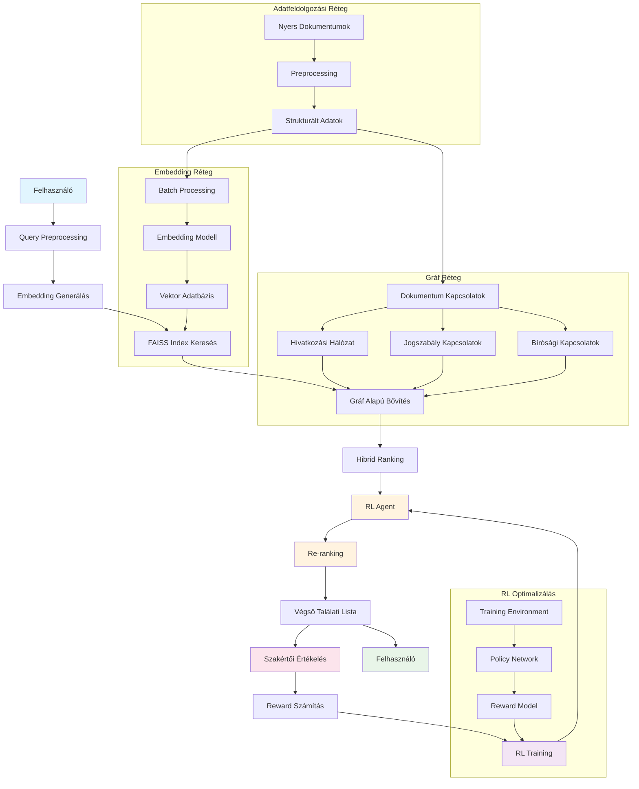

# CourtRankRL: Magyar Bírósági Határozatok Szemantikus Keresőrendszere Megerősítéses Tanulással

## Projekt Áttekintés

Ez a projekt egy komplex, end-to-end megoldást mutat be magyarországi bírósági határozatok hatékony szabadszöveges keresésére. A rendszer egy többlépcsős architektúrát implementál, amely kezdetben szemantikus embeddingek alapján végez hasonlóság-alapú keresést, majd megerősítéses tanulással (RL) finomhangolt intelligens ágensek segítségével optimalizálja a végső találati listát a releváns dokumentumok jobb rangsorolása érdekében.

## Kutatási Motiváció

A modern jogi információkeresés egyik legnagyobb kihívása a szabadszöveges lekérdezések hatékony feldolgozása nagy volumenű dokumentumkorpuszokon. A hagyományos kulcsszó-alapú keresési rendszerek gyakran nem képesek megfelelően kezelni a jogi terminológia komplexitását és a kontextuális jelentéseket. Ez a projekt egy innovatív megközelítést alkalmaz, amely ötvözi a modern nyelvmodell-alapú szemantikus keresést a megerősítéses tanulás adaptív optimalizálási képességeivel.

## Rendszer Architektúra

A következő diagram ábrázolja a teljes end-to-end rendszer működését a felhasználói lekérdezéstől a megerősítéses tanulással optimalizált végső eredményig:


```mermaid
graph TD
    A["Felhasználó"] --> B["Query Preprocessing"]
    
    B --> C["Embedding Generálás"]
    
    C --> D["FAISS Index Keresés"]
    
    D --> D1["Gráf Alapú Bővítés"]
    
    D1 --> E["Hibrid Ranking"]
    
    E --> F["RL Agent"]
    
    F --> G["Re-ranking"]
    
    G --> H["Végső Találati Lista"]
    
    H --> I["Felhasználó"]
    
    H --> J["Szakértői Értékelés"]
    
    J --> K["Reward Számítás"]
    
    K --> L["RL Training"]
    
    L --> F
    
    subgraph "Adatfeldolgozási Réteg"
        M["Nyers Dokumentumok"]
        N["Preprocessing"]
        O["Strukturált Adatok"]
        M --> N --> O
    end
    
    subgraph "Embedding Réteg"
        P["Batch Processing"]
        Q["Embedding Modell"]
        R["Vektor Adatbázis"]
        O --> P --> Q --> R
        R --> D
    end
    
    subgraph "Gráf Réteg"
        V["Dokumentum Kapcsolatok"]
        W["Hivatkozási Hálózat"]
        X["Jogszabály Kapcsolatok"]
        Y["Bírósági Kapcsolatok"]
        O --> V
        V --> W
        V --> X
        V --> Y
        W --> D1
        X --> D1
        Y --> D1
    end
    
    subgraph "RL Optimalizálás"
        S["Training Environment"]
        T["Policy Network"]
        U["Reward Model"]
        S --> T --> U --> L
    end
    
    style A fill:#e1f5fe
    style I fill:#e8f5e8
    style F fill:#fff3e0
    style G fill:#fff3e0
    style J fill:#fce4ec
    style L fill:#f3e5f5
```

### Főbb Rendszerkomponensek

- **Adatfeldolgozási Réteg**: Több mint 200,000 bírósági határozat feldolgozása és strukturálása. *(Megjegyzés: a pontos szám a felhasznált adatforrástól függ.)*
- **Embedding Réteg**: `Qwen/Qwen3-Embedding-0.6B` (1024D) modell használata. Az embedding generálás GPU-t igényel (pl. A100), de a rendszer többi része CPU-n is futtatható.
- **Gráf Réteg**: NetworkX irányított gráf, amely a dokumentumok, jogszabályok és bíróságok kapcsolatait modellezi. *(Megjegyzés: a gráf mérete—csomópontok és élek száma—az adatbázis méretétől függ.)*
- **Hibrid Keresési Motor**: `faiss-cpu` alapú ANN keresés és gráf algoritmusok kombinációja.
- **RL Optimalizálás**: A rendszer egy `Gymnasium` alapú `RankingEnv`-et és egy `PyTorch`-ban implementált `PolicyNetwork`-öt tartalmaz. A jutalmazási modell NDCG-alapú. A GRPO algoritmus implementálása tervezett, a jelenlegi rendszer a keretrendszer alapjait fekteti le.

### Megerősítéses Tanulás alapú Re-ranking

A projekt egyik fő célkitűzése egy intelligens re-ranking rendszer létrehozása, amely a DeepSeek által fejlesztett **Group Relative Policy Optimization (GRPO)** algoritmuson alapulna. A jelenlegi implementáció a szükséges környezetet és ágens-architektúrát tartalmazza, de a GRPO specifikus optimalizálási logikája még fejlesztés alatt áll.

## Technológiai Stack

### Core Components
- **Embedding Model**: `Qwen/Qwen3-Embedding-0.6B` (HuggingFace Transformers)
- **Vector Search**: `faiss-cpu` (Facebook AI Similarity Search)
- **RL Framework**: PyTorch + Gymnasium
- **Data Processing**: Pandas, NumPy, NetworkX
- **Infrastructure**: Python 3.9+

### Cloud Infrastructure
- **GPU Platform (Embeddinghez)**: RunPod, Vast.ai (ajánlott)
- **Ajánlott Hardver**: A embedding generáláshoz GPU (pl. Nvidia A100) javasolt. A keresőrendszer és az RL keretrendszer CPU-n is működőképes.

## Telepítés

A projekt futtatásához szükséges környezet beállítása `conda` segítségével javasolt az `environment.yml` fájl alapján.

1.  **Hozza létre a conda környezetet:**
    ```bash
    conda env create -f environment.yml
    ```

2.  **Aktiválja a környezetet:**
    ```bash
    conda activate courtrankrl
    ```

## Kutatási Hozzájárulások

### 1. GRPO-alapú Hibrid Keresési Architektúra Tervezete
A projekt egy olyan hibrid architektúrát vázol fel, amely kombinálja a modern szemantikus embeddingeket, a gráf alapú kapcsolati hálózatokat és a megerősítéses tanulást. A rendszer keretrendszerként szolgál a GRPO algoritmus jövőbeli, jogi dokumentumkeresési célú alkalmazásához.

### 2. Magyar Jogi Domain Adaptáció
Specializált pipeline magyar bírósági határozatok feldolgozására, amely figyelembe veszi a jogi terminológia sajátosságait és a magyar nyelv specifikus jellemzőit.

### 3. Szabály-alapú Reward Modelling
Innovatív objektív értékelési rendszer, amely szakértői annotáció helyett szabály-alapú kritériumokat használ (pontosság, relevancia, NDCG).

## Jövőbeli Fejlesztési Irányok

### Rövidtávú Célok
- **GRPO implementáció befejezése**: A placeholder logika teljes értékű implementálása.
- **Multi-modal embedding**: Dokumentum metaadatok integrálása
- **Hierarchikus keresés**: Jogterület-specifikus specializáció
- **Real-time learning**: Online RL algoritmusok implementálása

### Hosszútávú Vízió
- **Interdiszciplináris keresés**: Kapcsolódó jogterületek összekötése
- **Prediktív elemzés**: Hasonló ügyek kimenetelének előrejelzése

## A Projekt Hozzájárulásai

Ez a projekt demonstrálja, hogy a modern gépi tanulási technikák kombinációja jelentős javulást eredményezhet a specializált domain-specifikus keresési feladatokban. A megerősítéses tanulás alkalmazása a keresési eredmények re-ranking problémájára újszerű megközelítést jelent a magyar NLP kutatásokban.

A rendszer nem csupán egy technikai implementáció, hanem egy teljes kutatási framework, amely alkalmas további jogi informatikai alkalmazások fejlesztésére és a szemantikus keresés területén végzett alapkutatások támogatására.

## 🔧 Hibaelhárítás

### Qwen3 Modell Kompatibilitási Hiba

Ha az alábbi hibát kapod:
```
ValueError: The checkpoint you are trying to load has model type `qwen3` but Transformers does not recognize this architecture.
```

**Megoldási lehetőségek:**

#### 1. Környezet frissítése (Ajánlott)
```bash
# Környezet törlése és újralétrehozása frissített függőségekkel
conda env remove -n courtrankrl
conda env create -f environment.yml
conda activate courtrankrl
```

#### 2. Alternatív embedding modell használata
Módosítsd a `configs/config.py` fájlban az `EMBEDDING_MODEL` értékét:

```python
# Magyar nyelvre optimalizált alternatívák:
EMBEDDING_MODEL = "intfloat/multilingual-e5-large"  # 1024 dimenzió
EMBEDDING_DIMENSION = 1024

# Vagy kisebb, gyorsabb modell:
EMBEDDING_MODEL = "sentence-transformers/all-MiniLM-L6-v2"  # 384 dimenzió  
EMBEDDING_DIMENSION = 384
```

#### 3. Frissítés már létező környezetben
```bash
conda activate courtrankrl
pip install --upgrade transformers>=4.44.0 sentence-transformers>=3.0.0
```

### GPU Memória Problémák

Embedding generálás során GPU memória hiba esetén csökkentsd a batch méretet:
```python
EMBEDDING_BATCH_SIZE = 4  # csökkentve 8-ról 4-re
```

### FAISS Index Építési Problémák

Ha a FAISS index építése sikertelen:
```bash
# Ellenőrizd az adatok meglétét
python src/data_loader/build_faiss_index.py
```

---

**Készítette**: Zelenyiánszki Máté
**Intézmény**: Pannon Egyetem 
**Kutatási terület**: Természetes Nyelvfeldolgozás, Információvisszakeresés, Megerősítéses Tanulás  
**Implementáció**: Python, PyTorch, HuggingFace Transformers  
**Licenc**: Kutatási célú felhasználás